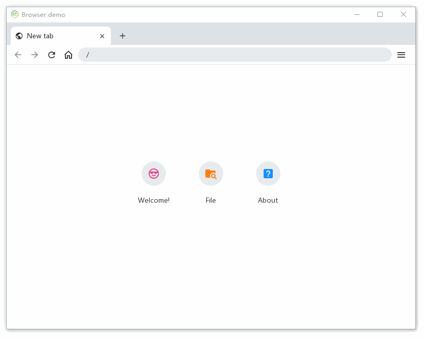

# lcui-router-app

(**English**/[中文](README.zh-cn.md))

A very simple browser-like application to show the LCUI and LCUI Router features.

[](./screenshot.gif)

## To Use

To clone and run this repository you'll need install the following tools on your computer:

- [Git](https://git-scm.com)
- [Node.js](https://nodejs.org/en/download/) (which comes with [npm](http://npmjs.com))
- [LCPkg](https://github.com/lc-soft/lcpkg):
    ```shell
    npm install -g lcpkg
    lcpkg setup
    ```
- [CMake](https://cmake.org/) or [XMake](https://xmake.io/)

From your command line:

```shell
# Clone this repository
git clone https://github.com/lc-ui/lcui-router-app

# Go into the repository
cd lcui-router-app

# Install NodeJS dependencies
npm install

# Install C/C++ dependencies for x64 CPU architecture
lcpkg install --arch x64

# Run the app with debug mode
lcpkg run start --mode debug
```

## What's included

- Some resource files.
- Some scripts that make it easy for you to quickly build application.
- Configuration files for [CMake](https://cmake.org/) and [XMake](https://xmake.io/) build tools, You can choose one of them that you like.
- Simple data storage implementation in `src/lib/store.c`.
- [.scss](https://sass-lang.com/guide) files for describe the user interface style.
- Implementation of the browser's graphical interface.
- Welcome page, about page, file page, 404 page, new tab page.
- Example for the routing navigation of the [LCUI Router](https://github.com/lc-soft/lcui-router).
- Examples of use of the [LC Design](https://github.com/lc-ui/lc-design) component library.

## Project Structure

- **`app`**: contains the resource files required for the application to run. You can use it as the working directory of the application, and when you publish your application, you only need to package the files in that directory.
- **`build`**: contains build tool output files.
- **`config/router.js`**: Configuration file for the LCUI Router, it can be compiled into a `src/lib/router.c` file using the `lcui compile router` command.
- **`scripts`**: contains build-related scripts and configuration files.
- **`src`**: contains the source code.
  - **`ui`**: contains source code related to the user interface.
    - **`stylesheets`**: contains the source code of stylesheets. You can put [.scss](https://sass-lang.com/guide) files here, they will be compiled into css files and outputed to the `app/assets/stylesheets` directory at build time.
    - **`components`**: contains the source code of the components.
    - **`views`**: contains the source code of the views.
  - **`lib`**: contains the base library code.

## License

[CC0 1.0 (Public Domain)](LICENSE.md)
